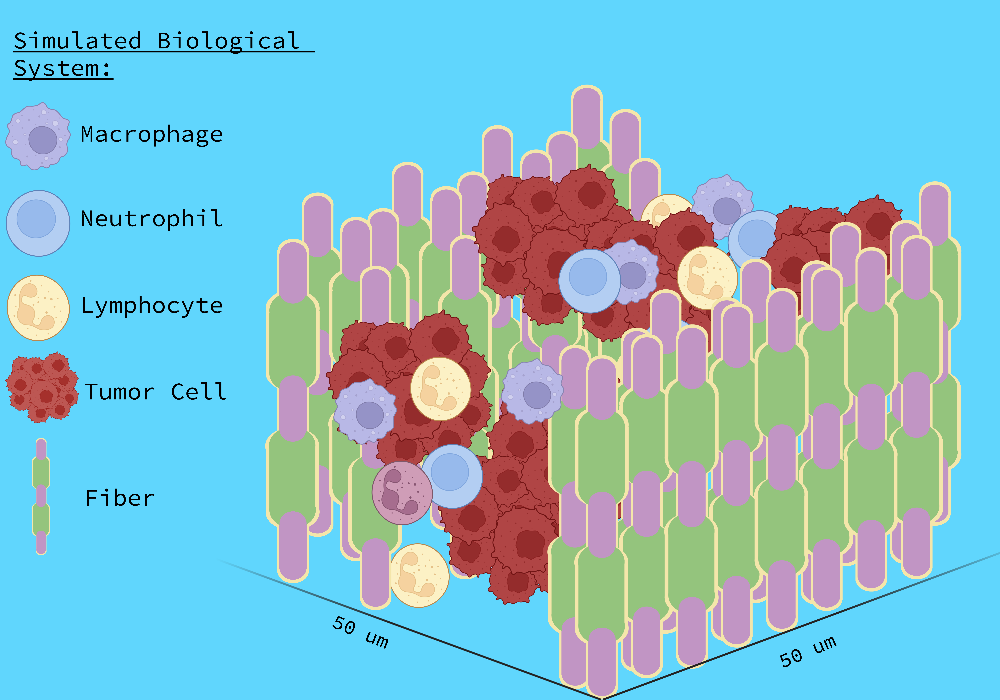

# dMRI-MCSIM

__gpuSimulation.py:__

gpuSimulation.py is a high preformance diffusion MRI Monte Carlo Simulation libarary with allows users to simulate molecular diffusion in a $[0 \mu m \text{ , } 200\mu m]^{3}$ imaging voxel with: 2 fiber bundles with set-able volume fractions, intrinsic diffusivities, and crossing angles, and non-overlapping cells of 2 radii, each with a volume fraction, which either aggregate around the fibers or being penetrated by the fibers. 


__Setting the intra-voxel tissue configuration:__

The tissue configuration is set in the following way:
```Python
    sim = dmri_simulation()
    sim.set_parameters(
        numSpins= 100*10**3,
        fiberFraction= (.10, .10),   # Fraction in each Half/Quadrant Depending on 'P'/'NP'
        fiberRadius= 5.0,            # um
        Thetas = (0,0),              # degrees
        fiberDiffusions= (2.0, 1.0), #um^2/mm
        cellFraction= .0,            # Fraction in each Half/Quadrant Depending on 'P'/'NP'
        cellRadii= (5,10),           # um
        penetrating = 'P',           # 'P' = Penetrating Cells; 'NP = Non-Penetrating Cells 
        Delta = 10,                  # ms 
        dt = .010,                   # ms 
        voxelDim= 200,               # um
        buffer = 100,                # um
        path_to_bvals= r"C:\Users\Administrator\Desktop\dMRI-MCSIM-main\Gradients\DBSI99\bval",
        path_to_bvecs= r"C:\Users\Administrator\Desktop\dMRI-MCSIM-main\Gradients\DBSI99\bvec"
        )   
```


