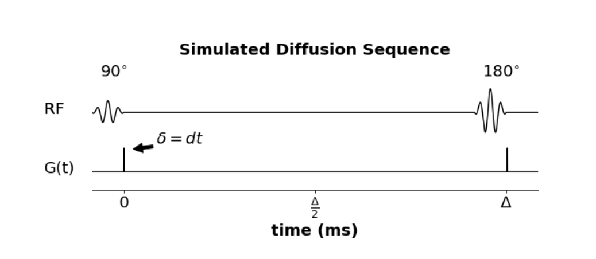

# dMRI-MCSIM

__gpuSimulation.py__

gpuSimulation.py is a high preformance diffusion MRI Monte Carlo Simulation libarary with allows users to simulate molecular diffusion in a $[0 \mu m \text{ , } 200\mu m]^{3}$ imaging voxel with: 2 fiber bundles with set-able volume fractions, intrinsic diffusivities, and crossing angles, and cells of 2 sizes either aggregating around the fibers or being penetrated by the fibers. 

