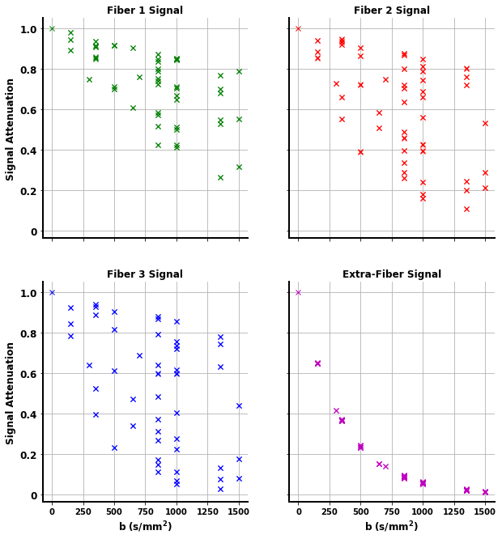

*********************
Quickstart
*********************

In this tutorial, we will show how to use ``simDRIFT`` to execute some example simulations. 
Throughout, we will make use of a few Python libraries.

.. code-block:: python
    
    import numpy as np     
    import nibabel as nb 
    import matplotlib.pyplot as plt 
    import dipy.reconst.dti as dti
    from dipy.core.gradients import gradient_table

If you have an NVIDA-Cuda capable GPU, install ``simDRIFT`` by following these `instructions <https://simdrift.readthedocs.io/en/latest/install-index.html>`_ . If not, scroll to the bottom of the page and we will breifly go through an example using `Google Colab <https://colab.research.google.com/?utm_source=scs-index>`_. 

Isotropic Diffusion
----------------
As a first example, let's simulate isotropic diffusion in an imaging voxel featuring only water. That is,
our imaging voxel will feature no microstructural elements. First, navigate to ``examples/`` under your 
``simDRIFT`` installation root directory and run the following command in the console (if you're outside of the ``examples/`` directory, then you must enter the absolute path to the configuration file):

.. code-block:: bash 
    
    (simDRIFT) >simDRIFT simulate --configuration qs_isotropic_config.ini

The computation should finish within a minute or two, and the tool will produce a results directory, titled ``DATE_TIME_simDRIFT_Results/``, under which the following files and directories can be found:

* ``trajectories`` : A directory under which .npy files corresponding to the by-compartment *(cells, fiber, water, etc...)* and total initial (*trajectories_t1m*) and final (*trajectories_t2p*)
  spin positions are stored. The trajectory files may be useful for generating signals using a different diffusion scheme than the one provided 
  by the ``diff_scheme`` argument post-hoc. 

* ``signals`` : A directory under which NIfTI files containing the by-compartment and total signals generated from ``simDRIFT`` are stored. 

* ``log`` : A text file that contains a detailed description of the input parameters and a record of the simulation's execution

* ``input_configuration``: A copy of the input INI configuration file so that simulation input parameters may be referenced or simulations may be reproduced in the future. 

We can analyze the results using a simple python script:

.. code-block:: python

    # Load Data
    water_trajectories = np.load(r'PATH_TO_RESULTS/trajectories/water_trajectories_t2p.npy')

    # Plot Results 
    ax = plt.figure(figsize = (10,10)).add_subplot(projection = '3d')
    ax.scatter(water_trajectories[1:,0], water_trajectories[1:,1], water_trajectories[1:,2], alpha = 0.05, color = 'purple', s = 1)

    # For the figure legend
    ax.scatter(water_trajectories[0,0], water_trajectories[0,1], water_trajectories[0,2], alpha = 0.5, color = 'purple', s = 50, label = 'water spin')
    
    ax.view_init(elev = 20., azim = 135)
    ax.set_xlabel('x ($\mathbf{\mu m}$)', fontsize = 14, fontweight = 'bold')
    ax.set_ylabel('x ($\mathbf{\mu m}$)', fontsize = 14, fontweight = 'bold')
    ax.set_zlabel('x ($\mathbf{\mu m}$)', fontsize = 14, fontweight = 'bold')
    ax.legend(loc = 'center left', bbox_to_anchor = (1.07, 0.5), fancybox = True,
              shadow = True, prop = {'weight': 'bold', 'size': 15})

    plt.show()

.. figure:: water_trajectories.png
   :align: center

and to check that the ``simDRIFT`` reproduced the input ``water_diffusivity``:

.. code-block:: python 

    # Load Data
    bvals = np.loadtxt(r'.../simDRIFT/src/data/bval99')
    bvecs = np.loadtxt(r'.../simDRIFT/src/data/bvec99')

    water_signal = nb.load(r'.../signals/water_signal.nii').get_fdata()

    fig, ax = plt.subplots(figsize = (5,5))
    ax.plot(bvals, water_signal, 'mx')
    ax.set_yticks([0, 0.2, 0.6, 0.8, 1.0])
    ax.set_yticklabels([0, 0.2, 0.6, 0.8, 1.0], fontsize = 12, fontweight = 'bold')
    ax.set_xticks([0, 250, 500, 750, 1000, 1250, 1500])
    ax.set_xticklabels([0, 250, 500, 750, 1000, 1250, 1500], fontsize = 10, fontweight = 'bold')
    ax.spines['top'].set_visible(False)
    ax.spines['right'].set_visible(False)
    ax.spines['left'].set_linewidth(2)
    ax.spines['bottom'].set_linewidth(2)
    ax.grid()
    ax.set_ylabel('Signal Attenuation', fontsize = 12, fontweight = 'bold')
    ax.set_xlabel('b $\mathbf{s / ms^{2}}$', fontsize = 12, fontweight = 'bold')

    plt.show()

.. code-block:: python
    
    #Analyze resulst with Dipy 
    gtab = gradient_table(bvals, bvecs)
    tenmodel = dti.TensorModel(gtab)
    tenfit = tenmodel.fit(water_signal)

    print(1e3 * tenfit.ad, 1e3 * tenfit.rd)

The axial and radial diffusivity of the DTI estimated diffusion tensor are 3.006 :math:`\mu m^{2} / ms` and 2.997 :math:`\mu m^{2} / ms`, confirming 
that the diffusion process was indeed isotropic and that ``simDRIFT`` faithfully reproduced the input diffusivity here. 

Three Crossing Fibers 
----------------
Now, let's simulate a more complicated imaging voxel featuring three crossing fibers with intrinsic diffusivities :math:`1.0`, :math:`2.0`, and :math:`3.0`, and orientations :math:`0^{\circ}`, 
:math:`45^{\circ}`, :math:`135^{\circ}` respectively. To do so, ensure you're current working directory is still the ``examples/`` directory, and type the following command:

.. code-block:: bash 
    
    (simDRIFT) >simDRIFT simulate --configuration qs_three_fibers_config.ini

The computation should finish within about five or six minutes.

.. code-block:: python

  
    # Load Data
    fiber_1_trajectories = np.load('PATH_TO_RESULTS/trajectories/fiber_1_trajectories_t2p.npy')
    fiber_2_trajectories = np.load('PATH_TO_RESULTS/trajectories/fiber_2_trajectories_t2p.npy')
    fiber_3_trajectories = np.load('PATH_TO_RESULTS/trajectories/fiber_3_trajectories_t2p.npy')
    water_trajectories   = np.load(r'PATH_TO_RESULTS/trajectories/water_trajectories_t1m.npy')

     # Plot Results
    ax = plt.figure(figsize = (10,10)).add_subplot(projection = '3d')
    ax.scatter(water_trajectories[1:,0], water_trajectories[1:,1], water_trajectories[1:,2], alpha = 0.1, color = 'purple', s = 1)
    # For the figure legend
    ax.scatter(water_trajectories[0,0], water_trajectories[0,1], water_trajectories[0,2], alpha = 0.5, color = 'purple', label = 'water spin')
    ax.scatter(fiber_1_trajectories[:,0], fiber_1_trajectories[:,1], fiber_1_trajectories[:,2], color = 'green', label = 'fiber 1 spin')
    ax.scatter(fiber_2_trajectories[:,0], fiber_2_trajectories[:,1], fiber_2_trajectories[:,2], color = 'red',   label = 'fiber 2 spin')
    ax.scatter(fiber_3_trajectories[:,0], fiber_3_trajectories[:,1], fiber_3_trajectories[:,2], color = 'blue',  label = 'fiber 3 spin')

    ax.view_init(elev = 20., azim = 135)
    ax.set_xlabel('x ($\mathbf{\mu m}$)', fontsize = 14, fontweight = 'bold')
    ax.set_ylabel('x ($\mathbf{\mu m}$)', fontsize = 14, fontweight = 'bold')
    ax.set_zlabel('x ($\mathbf{\mu m}$)', fontsize = 14, fontweight = 'bold')
    ax.legend(loc = 'center left', bbox_to_anchor = (1.07, 0.5), fancybox = True,
          shadow = True, prop = {'weight': 'bold', 'size': 15})

    plt.show()

The signal can by analyzed with the below script

.. code-block:: python 

    # Load Data
    bvals = np.loadtxt(r'.../simDRIFT/src/data/bval99')
    bvecs = np.loadtxt(r'.../simDRIFT/src/data/bvec99')
    
    fiber_1_signal = nb.load(r'.../signals/fiber_1_signal.nii').get_fdata()
    fiber_2_signal = nb.load(r'.../signals/fiber_2_signal.nii').get_fdata()
    fiber_3_signal = nb.load(r'.../signals/fiber_3_signal.nii').get_fdata()
    water_signal = nb.load(r'.../signals/water_signal.nii').get_fdata()

    # Plot Results
    fig, axs = plt.subplots(2,2, figsize = (10,10), sharex = True, sharey = True)

    axs[0,0].plot(bvals, fiber_1_signal, 'gx')
    axs[0,1].plot(bvals, fiber_2_signal, 'rx')
    axs[1,0].plot(bvals, fiber_3_signal, 'bx')
    axs[1,1].plot(bvals, water_signal,   'mx')

    for ax in axs.flatten():
        ax.set_yticks([0, 0.2, 0.6, 0.8, 1.0])
        ax.set_yticklabels([0, 0.2, 0.6, 0.8, 1.0], fontsize = 12, fontweight = 'bold')
        ax.set_xticks([0, 250, 500, 750, 1000, 1250, 1500])
        ax.set_xticklabels([0, 250, 500, 750, 1000, 1250, 1500], fontsize = 10, fontweight = 'bold')
        ax.spines['top'].set_visible(False)
        ax.spines['right'].set_visible(False)
        ax.spines['left'].set_linewidth(2)
        ax.spines['bottom'].set_linewidth(2)
        ax.grid()

    axs[0,0].set_ylabel('Signal Attenuation', fontsize = 12, fontweight = 'bold')
    axs[1,0].set_ylabel('Signal Attenuation', fontsize = 12, fontweight = 'bold')
    axs[1,0].set_xlabel('b $\mathbf{s / ms^{2}}$', fontsize = 12, fontweight = 'bold')
    axs[1,1].set_xlabel('b $\mathbf{s / ms^{2}}$', fontsize = 12, fontweight = 'bold')
    
    axs[0,0].set_title('Fiber 1 Signal', fontsize = 12, fontweight = 'bold')
    axs[0,1].set_title('Fiber 2 Signal', fontsize = 12, fontweight = 'bold')
    axs[1,0].set_title('Fiber 3 Signal', fontsize = 12, fontweight = 'bold')
    axs[1,1].set_title('Water Signal', fontsize = 12, fontweight = 'bold')
    
    plt.show()

.. code-block:: python

    gtab = gradient_table(bvals, bvecs)
    tenmodel = dti.TensorModel(gtab)
    tenmodel.fit(water_signal)

    tenfit_1 = tenmodel.fit(fiber_1_signal)
    tenfit_2 = tenmodel.fit(fiber_2_signal)
    tenfit_3 = tenmodel.fit(fiber_3_signal)
    tenfit_water = tenmodel.fit(water_signal)

    print(1e3 * tenfit_1.ad, 1e3 * tenfit_2.ad, 1e3 * tenfit_3.ad, 1e3 * tenfit_water.ad, 1e3 * tenfit_water.rd)

For the fibers, are estimated axial diffusivities are :math:`\lambda_{||}^{(1)} =` 0.996, :math:`\lambda_{||}^{(2)} =` 2.007,
:math:`\lambda_{||}^{(3)} =` 2.996, and for the water, we get that: :math:`\lambda_{||} =` 2.82 and :math:`\lambda_{\perp} =` 2.73. The fiber values are exactly in the range that we would expect. Of course, although the water diffusivity is set to 3.0, because of the diffusion
restricting barriers imposed by the fiber bundles, we can no longer hope to recover this number exactly (at reasonably high fiber densities).

Google Colab
--------------
First, open a new Google Colab notebook. Then, nagivate to Edit> Notebook Settings and change the ``Hardware Accelorator`` to GPU. 
To install Conda, type the following commands. 

.. code-block:: python 
   
    [ ] #Install Conda
        !pip install -q condacolab
        import condacolab
        condacolab.install()

Now, we create the ``simDRIFT`` environment:

.. code-block:: python 
   
   [1] #Create Conda Environment 
       !conda create -n simDRIFT    

To activate the environment:

.. code-block:: python 
   
   [2] #Activate Conda Environment 
       !source activate simDRIFT

Now that the environment is activated, we can install the dependencies:

.. code-block:: python 
   
   [3] #Install Numba
       !conda install numba
        #Install PyTorch
       !pip3 install torch torchvision torchaudio --index-url https://download.pytorch.org/whl/cu117

Now, we install ``simDRIFT``

.. code-block:: python 
   
   [4] #Install simDRIFT
       !git clone https://github.com/jacobblum/simDRIFT.git
       !pip install -e simDRIFT 

Finally, now that everything is installed let's run a basic simulation of isotropic diffusion. 

.. code-block:: python 
   
   [5] !simDRIFT simulate --configuration PATH_TO_CONFIG.INI file
