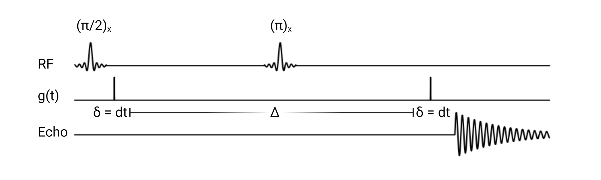

Theory
==============================

Introductory MR Concepts:
---------------------------------------------------------------
The following section will present a
constructive derivation of the Bloch and Bloch-Torrey equations and their
corresponding analytical solutions. The material discussed in this section is
fundametal to understanding diffusion-weighted MRI signal aquisition and
modeling, and naturally motivates the need for Monte-carlo methods to simulate
diffusion MRI.

+++++++++++++++++++++++++++++++++
The Physics of Magnetic Resonance
+++++++++++++++++++++++++++++++++
In this section, we will present the physical concept of Zeeman splitting and
its relationship to Nuclear Magnetic Resonance (NMR) [#Callaghan]_. Given the
quantum-mechanical nature of this physical phenomenon, throughout this section
we will frequenlty use Paul Dirac's *bra-ket* notation. Therefore, to be
precise:

Letting :math:`\mathcal{H}` be a finite dimensional vector space, :math:`v \in \mathcal{H}`
may be denoted by the symbol :math:`\ket{v}`, called a *ket*. Its corresponding element in the 
dual space :math:`\mathcal{H}^{*}`, denoted by :math:`\langle v, \cdot \rangle = \bra{v}` is called a *bra*
and can be thought of as a functional that acts on :math:`\ket{v}`. Appling a *bra* to a *ket*
forms :math:`\langle u | v \rangle = \langle u, v \rangle`, a *bra-ket*, which is an inner product on :math:`\mathcal{H}`.

We will begin by discussing Angular momentum. The conservation of angular
momentum is a fundamental physical law that reflects the isotropy of space. We
will denote the total angular momentum operator by :math:`\mathbf{J} = \begin{pmatrix}J_{x}, & J_{y}, & J_{z}, \end{pmatrix}`
Assuming, by convention :math:`z` to be the quantization axis, we have the following relationships:

.. math::
    \mathbf{J}^{2} \ket{j,m} = j(j+1)\hbar^{2} \ket{j,m},
    \qquad
    \mathbf{J}_{z} \ket{j,m} = m \hbar \ket{j,m},

Where :math:`j` assumes interger or half interger values, and :math:`m` assumes values :math:`-j, -j+1, \cdots j`

Protons, the particle of interest in most MRI and diffusion MRI experiements,
however, are equipped with a sort of internal angular momentum called
*spin*. In particular, the spin of a :math:`{}^{1}H` nucleus is an intrinsic
angular momentum that describes the internel degrees of freedom of the proton.
We will denote the spin angular momentum operator by

.. math::
     \mathbf{I} = \frac{\hbar}{2}\begin{pmatrix} \sigma_{1}, & \sigma_{2}, & \sigma_{3} \end{pmatrix}.

Because :math:`\mathbf{I}` is an angular momentum operator, it satifies the eigenvalue
relations for the general angular momentum operators presented above. In particular, we have that

.. math::
      \mathbf{I}^{2} \ket {I, m} = I (I + 1) \ket{I, m}, \qquad
      \sigma_{3} \ket{I,m } = m \hbar \ket{I,m},

where :math:`I = \frac{1}{2}` and is thus quantized by :math:`m = -\frac{1}{2}, +\frac{1}{2}`, 
and :math:`\sigma_{i}` the *i-th* Pauli matrix.

Given a spin operator, we may define that spins nuclear magnetic moment
operator, :math:`\boldsymbol{\mu}`. The relationship between the nuclear magnetic
moment operator :math:`\boldsymbol{\mu}` and the angular momentum operator is given
by

.. math:: 
      \boldsymbol{\mu} = \gamma_{N} \frac{h}{2\pi} \mathbf{I},

where :math:`\gamma_{N}` is the gyromagnetic ration and :math:`h` is Plank's constant.

Therefore, a proton (with no kinetic energy) moving in a homogenous
electromagnetic field is described by the following Hamiltonian operator, which can be
thought of as the generator of the evolution our quantum system. In particular

.. math:: 
    \mathbf{H} = - \mathbf{B} \cdot \boldsymbol{\mu} = - \displaystyle \sum_{i} \frac{h}{4\pi} \gamma_{N} \textbf{B}_{i}\sigma_{i}.

Conventionally, the gradient is defined as :math:`\mathbf{B} = \begin{pmatrix} 0, & 0, & B_{0} \end{pmatrix}`.

Using the gradient defined above and substituting the Hamiltonian 
into the Schrodinger equation, we get that

.. math::
     E \ket{I, m} = \begin{pmatrix}
        -\frac{\hbar}{2} \gamma_{N}B_{0} & 0 \\
        0 & \frac{\hbar}{2} \gamma_{N}B_{0}
    \end{pmatrix} \ket{I, m}.

Therefore, we see that the energy states of the quantum system are given by the expression

.. math::
     E_{m} = - m \frac{h}{2\pi} \gamma_{N} B_{0}, \quad m = -\frac{1}{2}, + \frac{1}{2}.

This equation has two important implications. First, we
immediately notice that in the absense of an external gradient, the two possible
energy states associated to quantum numbers :math:`\pm \frac{1}{2}` are degenerate.
Second, we see that in the presence of the external gradient, the degeneracy is
resolved by the external gradient in a linear manner.

We remark that a non-trival population of spins with quantum number :math:`-\frac{1}{2}` 
align in an anti-parallel manner with respect to the external
gradient; however, this alignment corresponds to a higher Zeeman energy, and
thus we observe spin excess in the parallel, :math:`+ \frac{1}{2}`, configuration.
This phenomenon is called Zeeman splitting. 

Fundamentally, NMR relies on transitions between the two Zeeman energies to
initiate signal aquisition. The energy required to excite spins to the higher
energy state is given by

.. math::
     |\Delta E | = \frac{h}{2} \gamma B_{0} |\Delta m_{I} | = \frac{h}{2} \underbrace{ \gamma_{N}B_{0}}_{\omega_{0}}.

The quantity :math:`\omega_{0}` is called the Larmor Frequency, and generally falls
into to the radio frequency (RF) range. Application of an RF pulse in the
transverse plane, orthogonal to the net magnetization vector, at the Larmor
frequency causes the net magnetization vector to tip out of its equilibrium
state and precess about a new axis defined by the flip angle 
:math:`\alpha =\omega_{0}t` where *t* is a time parameter. Receiver coils in the transverse
plane measure the frequency of this precession, and thus a signal is detected. 

The Bloch Equation
-------------------
The Bloch equations model the time evolution of the *net-magnetization vector*:

The net magnetization, in some small volume element :math:`\Omega` is

.. math::
    \boldsymbol{M}(\boldsymbol{r}, t) = \frac{1}{|\Omega|} \displaystyle \sum_{i \in \Omega}\boldsymbol{\mu}_{i}.

The Bloch equations, follow immediately from the above

.. math::
    \frac{1}{|\Omega|}\displaystyle \sum_{i \in \Omega} \; \frac{\partial}{\partial t} \mu_{i} = \frac{\gamma}{|\Omega|} \displaystyle \sum_{i \in \Omega} \mu_{i} \times \mathbf{B}.

However, the above expression is certainly oversimplified, as it
neglects proton interactions with its local magnetic environment, which are
modeled by the decay parameters :math:`T_{1}` and :math:`T_{2}`. The derivation of the Bloch
equations with relaxation terms is beyond the scope of this introduction, and we refer
the interested reader to Bloch's *Nuclear Induction, 1970*. In general,
however, we remark it is this complete form of the Bloch equation that we are
interested in solving.

For general experimental conditions, analytic solutions to the Bloch equations
do not exist, and standard numerical recipies such as forward Euler time
stepping are deployed. However, under certain simplifications an analytic solution is easily
found. In particular, let :math:`\mathbf{B}` be the a magnetic field normal to the
transverse imaging plane. 

.. math::
    \begin{cases}
        \frac{\partial}{\partial t } \mathbf{M}(\mathbf{r}, t) = \gamma \; \mathbf{M} \times \mathbf{B} - \frac{\mathbf{M}_{x} \hat{\mathbf{i}} + \mathbf{M}_{y}\hat{\mathbf{j}}} {T_{2}} - \frac{\mathbf{M}_{z}-\mathbf{M}_{o}}{T_{1}} \hat{\mathbf{k}} \\
       \mathbf{B} = \begin{pmatrix}
          0, & 0, & \mathrm{B}_{0}
       \end{pmatrix}
    \end{cases}

Re-writing into a more convienent matrix form, we immediately
see that differential operator acts as an affine transformation of the net
magnetization vector. 

.. math::
    \frac{\partial}{\partial t } \mathbf{M}(\mathbf{r}, t) = \underbrace{\begin{bmatrix}
        -\frac{1}{T_{2}} & \gamma \mathrm{B}_{0} & 0 \\
        -\gamma \mathrm{B}_{0} & -\frac{1}{T_{2}} & 0 \\
        0 & 0 & -\frac{1}{T_{1}}
    \end{bmatrix}}_{\mathbf{R}} \mathbf{M}(\mathbf{r}, t) + \underbrace{\begin{bmatrix}
        0 \\
        0 \\
        \frac{\mathbf{M}_{0}}{T_{1}}
    \end{bmatrix}}_{\mathbf{b}}

Because :math:`\mathbf{A}` is guaranteed to be invertible, we may define a mapping
that produces a linear first order system of Differential Equations.

.. math::
    \mathbf{M}(\mathbf{r}, t) \mapsto \hat{\mathbf{M}}(\mathbf{r}, t) - \mathbf{A}^{-1}\mathbf{b}

Under this mapping, we may re-write the Bloch-Equations more compactly as

.. math::
    \frac{\partial}{\partial t } \hat{\mathbf{M}} (\mathbf{r}, t) = \mathbf{A} \hat{\mathbf{M}}(\mathbf{r}, t),

which has the general time-dependent solution given by

.. math:: 
    \hat{\mathbf{M}}(\mathbf{r}, t)_{\text{Bloch}} = \exp \bigg( \mathbf{A}t \bigg) \hat{\mathbf{M}}(\mathbf{r}, 0). 

The equilibrium value of :math:`\hat{\mathbf{M}}(\mathbf{r}, 0)` represents the initial spin
density, which seeks to minimize both the Zeeman potential and energy
associated by the spins thermal contact with the ambient spin bath. We remark that more 
explicit closed forms may be obtained by recalling from statistical physics the Boltzman Distribution
to elucidate the exact form of :math:`\hat{\mathbf{M}}(\mathbf{r}, 0)` for a given temperature. 

The Bloch equation represents a useful tool for analyzing the time evolution of
a spin ensemble's net magnization vector, :math:`\hat{\mathbf{M}}(\mathbf{r},t)_{\text{Bloch}}`, 
as the ensemble interacts with an external gradient
:math:`\textbf{B}` and applied RF pulses. However, the Bloch equation assumes that the
spins themselves are stationary, which is not always the case. In 1956, H.C.
Torrey, one of Purcell's collaborators, generalized the Bloch equation to
further model the motional processes of spins within the ensemble by adding a
diffusion term to the Bloch Equation. The model proposed by Torrey, the
Bloch-Torrey equation, is an important theoretical repository of modern MR
techniques sensitive to motional processes. One notable example is of these
techniques is diffusion MRI.

The Bloch-Torrey Equation
------------------------------
Diffusion of the spin ensemble's net magnetization vector will generally take
place by self-diffusion processes of NMR active (spin :math:`\frac{1}{2}`) nuclei. By
adding a diffusion term to the Bloch Equation, we obtain the phenomenological
Bloch-Torrey equation. Like the Bloch equation, analytic solutions do not exist
in general. However, under a certain set of assumptions, it is possible to
construct an analytic solution. We will adopt a perturbation theoretic approach
to show exactly these circumstances. Consider the following: 

.. math::
    \begin{cases}
        \displaystyle \frac{\partial}{\partial t } \; {\mathbf{M}}(\mathbf{r}, t) = \gamma \; {\mathbf{M}} \times \mathbf{B} - \frac{{\mathbf{M}}_{x} \hat{\mathbf{i}} + {\mathbf{M}}_{y}\hat{\mathbf{j}}} {T_{2}} - \frac{{\mathbf{M}}_{z}-{\mathbf{M}}_{o}}{T_{1}} \hat{\mathbf{k}} + \nabla \cdot \mathbf{D}(\mathbf{r})
    \nabla {\mathbf{M}}
     \\
    \mathbf{B} = \begin{pmatrix}
       0 & 0 & \mathrm{B}_{0}
    \end{pmatrix}
    \\
    \mathbf{D}(\mathbf{r}) = \mathbf{D}_{0} + \varepsilon \mathbf{D}_{1}(\mathbf{r}) + \cdots + \varepsilon^{n}\mathbf{D}_{n}(\mathbf{r}) \\
    \end{cases}.

Re-writing the above equation into its matrix formulation, we
obtain

.. math::
    \frac{\partial}{\partial t } \hat{\mathbf{M}}(\mathbf{r}, t) = \mathbf{A}\hat{\mathbf{M}}(\mathbf{r}, t) + \nabla \cdot \mathbf{D}(\mathbf{r}) \nabla \hat{\mathbf{M}}(\mathbf{r}, t),
.. math::
    \begin{split}
      \frac{\partial}{\partial t } \hat{\mathbf{M}}(\mathbf{r}, t) = \mathbf{A}\hat{\mathbf{M}}(\mathbf{r}, t) + \nabla \cdot \mathbf{D}_{0} \nabla \hat{\mathbf{M}}(\mathbf{r}, t) & + \varepsilon \nabla \cdot \mathbf{D}_{1}(\mathbf{r}) \nabla \hat{\mathbf{M}}(\mathbf{r}, t) 
      \\
      & + \cdots +\varepsilon^{n} \nabla \cdot \mathbf{D}_{n}(\mathbf{r}) \nabla \hat{\mathbf{M}}(\mathbf{r}, t).
    \end{split}

Letting :math:`(\varepsilon \longrightarrow 0)`, we see that the above equation
may be written as

.. math:: 
     \frac{\partial}{\partial t } \hat{\mathbf{M}}(\mathbf{r}, t) = \mathbf{A}\hat{\mathbf{M}}(\mathbf{r}, t) + \nabla \cdot \mathbf{D}_{0} \nabla \hat{\mathbf{M}}(\mathbf{r}, t) + \mathcal{O}(\varepsilon).
     
:math:`\mathbf{D}_{0}` having no spatial dependence makes Bloch-Torrey amenable to an
analytic solution. Of course, we make the remark that in biological solids,
ordered tissue micro structure usually acts as a barrier to self-diffusion
processes, and so the 0-th order approximation of the spatially-dependent
diffusion tensor :math:`\mathbf{D}(\mathbf{r})` is of course an incredible oversimplification. Still,
finding the solution here will show important concepts regarding the Fourier
relationship between the dMRI signal and the average diffusion propagator. Given
that we are trying to motivate the need for Monte Carlo (MC) simulation, this is
sufficient for our purposes. 

.. math:: 
     \frac{\partial}{\partial t } \hat{\mathbf{M}}(\mathbf{r}, t) = \mathbf{A}\hat{\mathbf{M}}(\mathbf{r}, t) + \mathbf{D}_{0} \nabla^{2} \hat{\mathbf{M}}(\mathbf{r}, t).

We proceed by taking the Fourier transform

.. math::
    \frac{\partial}{\partial t } \{ \hat{\mathbf{M}}(\mathbf{r}, t) \}(\mathbf{q}) = \mathbf{A}\mathcal{F} \{ \hat{\mathbf{M}}(\mathbf{r}, t) \}(\mathbf{q}) + (i |\mathbf{q} |)^{2} \mathbf{D}_{0} \mathcal{F} \{ \hat{\mathbf{M}}(\mathbf{r}, t) \}(\mathbf{q}).

Collecting the Matrix valued terms, we obtain a linear system of Partial
Differential Equations

.. math:: 
    \frac{\partial}{\partial t } \mathcal{F} \{ \hat{\mathbf{M}}(\mathbf{r}, t) \}(\mathbf{q}) = \bigg( \mathbf{A} + (i |\mathbf{q} |)^{2} \mathbf{D}_{0} \bigg) \mathcal{F} \{ \hat{\mathbf{M}}(\mathbf{r}, t) \}(\mathbf{q}).

The solution, as we have seen is the case for the Bloch Equation, is given by

.. math:: 
    \mathcal{F} \{ \hat{\mathbf{M}}(\mathbf{r}, t) \}(\mathbf{q}) = \exp \bigg(\mathbf{A}-|\mathbf{q}|^{2} \mathbf{D}_{0} t \bigg) \mathcal{F} \{ \hat{\mathbf{M}}(\mathbf{r}, 0) \} (\mathbf{q}).

Taking the inverse Fourier transform of this general solution, we obtain

.. math::
     \hat{\mathbf{M}}(\mathbf{r}, t) \}(\mathbf{r}, t) = \exp \bigg( \mathbf{A}t \bigg) \mathcal{F}^{-1} \bigg \{ \exp \bigg( -|\mathbf{q}|^{2} \mathbf{D}_{0}t \bigg) \mathcal{F} \bigg \{ \hat{\mathbf{M}}(\mathbf{r}, 0) \bigg \} (\mathbf{q})  \bigg \} (\mathbf{r}, t).

Therefore, through application of Fubini's theorem we can rearange the above into the following form

.. math:: 
     \begin{split}\hat{\mathbf{M}}(\mathbf{r}, t) = \left (\frac{1}{2\pi} \right)^{3} \exp \left ( \mathbf{A}t \right ) \int_{\mathbb{R}^{3}} \displaystyle & \mathrm{d}^{3}\mathbf{r} \; \hat{\mathbf{M}}(\mathbf{r}, 0) 
    \\
    & \cdot \underbrace{\left( \displaystyle \int_{\mathbb{R}^{3}} \mathrm{d}^{3}\mathbf{q} \;
      \exp \left( i\mathbf{q}^{\intercal}(\mathbf{r}^{\prime} - \mathbf{r} ) -|\mathbf{q}|^{2} \mathbf{D}_{0} t \right) \; \right).}_{\mathbf{K}(\mathbf{r}^{\prime} - \mathbf{r}, t)}
    \end{split}

Finding a closed form for :math:`\mathbf{K}(\mathbf{r}^{\prime} - \mathbf{r}, t)` amounts to
computing the integral

.. math:: 
    \mathbf{K}(\mathbf{r}^{\prime} - \mathbf{r}, t) = \bigg(\frac{1}{2\pi} \bigg)^{3} \displaystyle \int_{\mathbb{R}^{3}} \mathrm{d}^{3}\mathbf{q} \;
     \exp \bigg( i\mathbf{q}^{\intercal}(\mathbf{r}^{\prime} - \mathbf{r} ) -|\mathbf{q}|^{2} \mathbf{D}_{0}t \bigg) \; .

Completing the square and simplifying to a more familiar form, we get that

.. math:: 
    \begin{split}
    \mathbf{K}(\mathbf{r}^{\prime} - \mathbf{r}, t) &= \bigg(\frac{1}{2\pi} \bigg)^{3} \exp \bigg( {-\frac{|\mathbf{r}^{\prime} - \mathbf{r}|^{2}}{4\mathbf{D}_{0}t}} \bigg)
    \\
    & \displaystyle \int_{\mathbb{R}^{3}} \mathrm{d}^{3}\mathbf{q} \; \exp \bigg( - \bigg( \mathbf{q} \sqrt{\mathbf{D}_{0}t} - \frac{i}{2\sqrt{\mathbf{D}_{0}t}} (\mathbf{r}^{\prime} - \mathbf{r} ) \bigg)^{2} \; \bigg).
    \end{split}

However, making a simple change of variables :math:`\mathbf{q} \mapsto \frac{\mathbf{s}}{\sqrt{\mathbf{D}_{0}t}} + \frac{i}{2\mathbf{D}_{0}t} (\mathbf{r}^{\prime}-\mathbf{r} )`, we get a familiar form

.. math::
      \mathbf{K}(\mathbf{r}^{\prime} - \mathbf{r}, t) = \bigg(\frac{1}{2\pi} \bigg)^{3} \frac{1}{(\mathbf{D}_{0}t)^{3/2} } \cdot \exp \bigg( {-\frac{|\mathbf{r}^{\prime} - \mathbf{r}|^{2}}{4\mathbf{D}_{0}t}} \bigg) \displaystyle \int_{\mathbb{R}^{3}} \mathrm{d}^{3}\mathbf{s} \exp \bigg(-\mathbf{s}^{2} \bigg) 

Now the integral term here is just the Gaussian integral. We recognize this
function as the self-correlation function which denotes the probability of
moving from position :math:`\mathbf{r}` to :math:`\mathbf{r}^{\prime}` in time *t*. Henceforth, we will
denote :math:`\mathbf{K}(\mathbf{r}^{\prime} - \mathbf{r}, t)` by :math:`\boldsymbol{\mathcal{G}}(\mathbf{r} |\mathbf{r}^{\prime}, t)` 

.. math::
    \boldsymbol{\mathcal{G}}(\mathbf{r} | \mathbf{r}^{\prime}, t) = \mathbf{K}(\mathbf{r}^{\prime} - \mathbf{r}, t) = \bigg( \frac{1}{4\pi\mathbf{D}_{0}t} \bigg)^{3/2} \exp \bigg( {-\frac{|\mathbf{r}^{\prime} - \mathbf{r}|^{2}}{4\mathbf{D}_{0}t}} \bigg).

Thus, the general solution to Bloch-Torrey is given by the following

.. math::
     \hat{\mathbf{M}}(\mathbf{r}, t) = \exp (\mathbf{A}t) \cdot \displaystyle \int_{\mathbb{R}^{3}} \mathrm{d}^{3}\mathbf{r} \; \boldsymbol{\mathbf{G}}(\mathbf{r} | \mathbf{r}^{\prime}, t) \hat{\mathbf{M}}(\mathbf{r}, 0).

Therefore, for certain initial spin ensemble distributions we can expect to have
an analytic solution. 

The Pulsed Gradient Spin Echo (PGSE) Experiment
-----------------------------------------------
Developed by E.O. Stejskal and J.E. Tanner in 1965, the pulsed gradient spin
echo (PGSE) experiment sensitizes a spin ensemble's echo signal to the molecular
self-diffusion occurring between two applied gradient pulses [#Haacke]_. The general idea
is that a :math:`(\frac{\pi}{2})_{x}`` pulse tips the net magnetization into the
transverse plane, and then the bulk magnetization is hit with a gradient, :math:`\mathbf{g}`,
for duration :math:`\delta` that encodes a position-dependent phase shift according
to:

.. math::
     \varphi(t) = \displaystyle \int_{0}^{\tau = t} \mathrm{d} \tau \; \omega(\tau) 

The spin ensemble is then refocused with a :math:`\pi_{x}` pulse, and at time :math:`\Delta`
the gradient, :math:`\mathbf{g}`, is again applied for duration :math:`\delta`. Schematically, the
PGSE experiement is represented by:

    (\ **Top**\ ) Pulse sequence generated by radio frequency, or RF, transmission coils. (\ **Middle**\ ) Resultant diffusion gradient. (\ **Bottom**\ ) Spin echo signal measured by RF receive coils.

As depicted by the schematic, we adopt the narrow pulse approximation of the
applied magnetic gradients :math:`\mathbf{g}`. In particular, for the PGSE experiement we
have that
    
.. math::
     \mathbf{k}(\tau) = \gamma \delta \mathbf{g} \; \odot \bigg( -\delta^{3}(\tau) + \; \delta^{3}(\tau-\Delta) \bigg) 

where :math:`\mathbf{g} \in \mathbb{S}^{2}` is the direction of the gradient and :math:`\delta` is
the duration of the gradient pulse.

Substituting this expression into the phase shift equation, we get that 
the phase shift at acquisition time :math:`TE = \Delta` for the
PGSE experiment is given by

.. math::
     \varphi(t = \Delta) = \gamma \delta \displaystyle \int_{0}^{\tau = \Delta} \mathrm{d}\tau \; \displaystyle \sum_{i} \mathbf{g}_{i}\mathbf{r}_{i}(\tau) \cdot ( -\delta(\tau) + \; \delta(\tau-\Delta) )
.. math::
     \varphi(t = \Delta) = \gamma \delta \displaystyle \sum_{i} \mathbf{g}_{i} \cdot ( \mathbf{r}_{i}(\Delta) - \mathbf{r}_{i}(0)) = \gamma \delta \mathbf{g}^{\intercal} (\mathbf{r}^{\prime} - \mathbf{r})

Thus, we see that the phase shift is sensitive to the molecular self diffusion
of a spin from position :math:`\mathbf{r}` to position :math:`\mathbf{r}^{\prime}`. We remark that in the
actual PGSE experiment, the gradient pulse is instead defined by a scaled Dirac
delta so that the Fourier relationship between the signal echo and the diffusion
propagator is more explicit.

The Sjejskal-Tanner Equation
----------------------------
By the general solution we found for the Bloch-Torrey equations, the bulk magnetization vector,
:math:`\hat{\mathbf{M}}(\mathbf{r}, t)`, is the product of two independent sources of decay.
First, there is decay in the net magnetization due to the :math:`T_{1}` and :math:`T_{2}`
relaxation terms within the expression :math:`\exp (\mathbf{A}t)`. Secondly, the
magnetization vector experiences decay via the diffusion processes encoded in
the Green's function corresponding to the diffusion term. Because our goal is to
measure the signal decay only from diffusion processes, we simply divide the
measured signal echo in the presence of a gradient, :math:`S(\mathbf{g}, t)` by the signal
echo induced in the absence of an applied gradient, :math:`S(0, t)`, producing an echo
attenuation sensitive only to the self-diffusion processes of magnetic moment
bearing nuclei

.. math::
    E(\mathbf{g}, t) = \frac{S(\mathbf{g}, t)}{S(0,t)}.

Consider the PGSE experiment with wavevector :math:`\mathbf{q}` and gradient :math:`\mathbf{g}`

.. math::
    \left\{
        \begin{aligned} 
            \mathbf{q}(\tau) &= (2\pi)^{-1}\gamma \delta \mathbf{k}(\tau), \\
            \mathbf{k}(\tau) &= \gamma \delta \mathbf{g} \; \odot \bigg( -\delta^{3}(\tau) + \; \delta^{3}(\tau-\Delta) \bigg) \\
            \omega(\tau) &= \mathbf{k}(t)^{\intercal}\mathbf{r}(t). 
        \end{aligned}
    \right.

We make the remark that the frequency expression above is obtained by using the
Larmor frequency :math:`\gamma B_{0}` as a reference frequency so it may be neglected
in the detection process. Therefore, for spins within some neighborhood of
:math:`\mathbf{r}` such that they may be described by the local magnetization density
:math:`\boldsymbol{\rho}(\mathbf{r})`, the PGSE signal is given by

.. math::
    \mathrm{d} E(\mathbf{g}, t) = \boldsymbol \rho(\mathbf{r}) \mathrm{d}^{3}\mathbf{r} \cdot \exp \bigg(-i \varphi(t) \bigg).

Substituting in the result fron phase shift expression

.. math::
    \mathrm{d} E(\mathbf{g}, t = \Delta) = \boldsymbol \rho(\mathbf{r}) \mathrm{d}^{3}\mathbf{r} \cdot \exp \bigg(-i \gamma \delta \mathbf{g}^{\intercal} (\mathbf{r}^{\prime} - \mathbf{r}) \bigg)

where :math:`\boldsymbol\rho(\mathbf{r})` is given by the solution to Bloch-Torrey modulo the
relaxation terms, which are safely accounted for via the division of the PGSE
signal :math:`S(\mathbf{g}, t)` by the Hahn echo signal :math:`S(0, t)`. Therefore

.. math:: 
    \boldsymbol\rho(\mathbf{r}) = \displaystyle \int_{\mathbb{R}^{3}} \mathrm{d}^{3}\mathbf{r} \; \boldsymbol{\mathcal{G}}(\mathbf{r} | \mathbf{r}^{\prime}, t) \hat{\mathbf{M}}(\mathbf{r}, 0) 

Making the substitution :math:`\mathbf{r} = \mathbf{r}^{'} - \mathbf{R}` we get that

.. math::
     \boldsymbol\rho(\mathbf{r}) = \bar{\boldsymbol{\mathcal{G}}}(\mathbf{R}, t) = \displaystyle \int_{\mathbb{R}^{3}} \mathrm{d}^{3}\mathbf{r} \; \boldsymbol{\mathcal{G}}(\mathbf{r} | \mathbf{r} + \mathbf{R}, t) \hat{\mathbf{M}}(\mathbf{r}, 0).

Here :math:`\bar{\boldsymbol{\mathcal{G}}}(\mathbf{R}, t)` is usually referred to by the
literature as the average diffusion propagator. 

We make the remark that if the diffusion process is unbounded, then the kernel
function :math:`\boldsymbol{\mathcal{G}}(\mathbf{r} | \mathbf{r}^{\prime}, t)` has no functional dependence
on :math:`\mathbf{r}`, but rather on the quantity :math:`||\mathbf{r}^{\prime} - \mathbf{r} ||^{2}`. Under these
circumstances, we see that the average diffusion propogator is given by

.. math::
     \bar{\boldsymbol{\mathcal{G}}}(\mathbf{R}, t) = \boldsymbol{\mathcal{G}}(\mathbf{r} | \mathbf{r}^{\prime}, t) \underbrace{\displaystyle \int_{\mathbb{R}^{3}} \mathrm{d}^{3}\mathbf{r} \;  \hat{\mathbf{M}}(\mathbf{r}, 0)}_{1}.

Substituting the general form for the spin density :math:`\boldsymbol \rho (\mathbf{r})` into
signal attention expression, we get that

.. math::
     \mathrm{d} E(\mathbf{g}, t = \Delta ) = \; \bar{\boldsymbol{\mathcal{G}}}(\mathbf{R}, \Delta ) \mathrm{d}\mathbf{R} \; \exp 
    \bigg(i\gamma \delta \mathbf{g}^{\intercal} \mathbf{R} \bigg) .

Defining a reciprocal space

.. math::
     \mathbf{q} = (2\pi)^{-1} \delta \gamma \mathbf{g} \longrightarrow 2\pi i \mathbf{q}^{\intercal} = i \gamma \delta \mathbf{g}^{\intercal}.

The careful reader will realize that by the relationship: :math:`2\pi i \mathbf{q}^{\intercal} = i\gamma \delta \mathbf{g}^{\intercal}`, 
the PGSE experiment essentially is sampling the Fourier
space of the diffusion propogator. In particular, we have that :math:`E(\mathbf{g}, t)` is
precisely the Fourier transformation of average diffusion propagator 
:math:`\bar{\boldsymbol{\mathcal{G}}} (\mathbf{R}, t)`

In the case of free, unrestricted diffusion, the average propagator is known to
us so we may actually compute the Fourier transform. By doing so we obtain the
famous Stejskal-Tanner equation for the PGSE experiment:

.. math::
    \begin{split}
    E(\mathbf{g}, t = \Delta ) = \bigg( \frac{1}{4\pi\mathbf{D}_{0}\Delta} \bigg)^{3/2} \displaystyle \int_{\mathbb{R}^{3}} \mathrm{d}^{3}\mathbf{r}^{\prime} \; &\exp \bigg( {-\frac{|\mathbf{r}^{\prime} - \mathbf{r}|^{2}}{4\mathbf{D}_{0}\Delta}} \bigg) \exp \bigg( 2\pi i \mathbf{q}^{\intercal} (\mathbf{r}^{\prime} - \mathbf{r} ) \bigg),
    \end{split}

.. math::
    E(\mathbf{g}, t = \Delta ) = \exp \bigg(-4\pi^{2}|\mathbf{q}|^{2} \boldsymbol{D}_{0} \Delta \bigg) = \exp \bigg( -\gamma^{2}\delta^{2}\mathbf{g}^{2}\mathbf{D}_{0}\Delta \bigg) \; .

The scalar :math:`\gamma^{2}\delta^{2}\mathbf{g}^{2}\Delta` is usually called the b-value,
or diffusion-weighting factor.

In more general cases, where diffusion is not completely unrestricted,
:math:`\bar{\boldsymbol{\mathcal{G}}} (\mathbf{R}, t)` and :math:`\mathbf{D}` have spatial dependence,
an analytic solution is intractable. Standard numerical methods like forward
Euler time-stepping or Chebyshev Spectral Methods, may yield solutions when the
spatial dependence of the diffusion tensor is not too complicated. On domains
designed to mimic biological tissue, finding a parametization of the spatially
dependent diffusion tensor is not possible. Therefore we must deploy Monte
Carlo Simulation methods to sample the diffusion propogator and compute a
solution.

Simulated Diffusion
------------------------------
To sample the diffusion propogator in a realistic manner, we simulate the molecular self-diffusion process for resident spins and calculate the resulting dMRI signal via pulsed gradient spin echo (PGSE) aquisition. The spin diffusion process is modelled via a random walk for each spin in the simulated ensemble. Spins are initially populated uniformly throughout the simulated image voxel. Subsequently, spin positions are updated at each time step under the constraint that they remain in the local environment in which they are initialized. Since the echo times typically used in diffusion magnetic resonance imaging (dMRI) experiments are below the mean preexchange lifetime (:math:`{\tau_i}`) of cellular water, we can safely neglect flux between the simulated microstructural components. The non-exchange of spins between tissue structures is ensured by rejection sampling of proposed steps beyond the relevant structure. At each time step :math:`\dd{t}`, spins are displaced by a distance determined by specified diffusivity of the relevant compartment. Spin displacment directions, :math:`\va{u} \in S^{2}`, are determined using the ``xoroshiro128+`` pseudo-random number generator. Specifically, the displacement of a spin during the :math:`{i^{\mathrm{th}}}` time step is given by

.. math::
    \va{r}_{i} = \va{r}_{i-1} + \sqrt{6 \mathbf{D}_{0}^{local}\dd{t}} \cdot \vu{u} 

Given the large number of spins required for convergence of the simulated PGSE signal, our code was developed with considerable 
attention towards preformance. To this end, spin trajectories are individually computed on a signle thread of the 
graphical processing unit (GPU), thus allowing for a non-linear relationship between the number of spins populated in the simulated voxel and overall runtime of the simulation. Typical experiements feature :math:`{[0.25,\, 1] \times 10^6}` spins and are completed within :math:`\sim 15` and :math:`60` minutes, depending on the complexity of the simulated microstructure. 

The diffusion process may be simulated for arbitrary geometries characterized by:

    - :math:`N_{\mathrm{fibers}} \in [0,\, 4]` distinct fiber populations, each with user-specified orientations, volume fractions, and intra-axonal diffusivities :math:`\mathbf{D}_{0}`, and 
    - :math:`N_{\mathrm{cells}} \in [0,\, 2]` distinct cell populations, each with user-specified radii and volume fractions.

Simulated Signal Acquisition
------------------------------
Data from the simulated spin trajectories is then used to compute the echo signal produced via PGSE sequence shown above:

The dMRI signal generated by the :math:`k^{\mathrm{th}}` diffusion gradient :math:`\va{g}_{k}` is calculated via standard numerical integration, which yields the following:

.. math::
    \eval{E(\va{g}_{k}, t)}_{t=TE} = \frac{1}{N_{\text{spins}}} \displaystyle\sum_{i = 1}^{N_{\text{spins}}} \exp\left( -i \sum_{t}^{N_{t}} \gamma \va{g}^{\intercal}_{k}(t) \cdot \va{r}(t) \dd{t} \right)

This signal can subsequently be used for, inter alia, the rapid prototyping, validation, and comparison of models for diffusion in biological tissue. At present, the authors are particularly interesting in evalutating various models of diffusion for their capacity to solve the `inverse problem`: recovery of ground truth intrinsic diffusivities for simulated biophysical structures in realistically-represented tissues.

References
----------
.. [#Callaghan] Callaghan PT. Principles of nuclear magnetic resonance microscopy. Oxford: Oxford University Press; 1995.
.. [#Haacke] Haacke EM, Brown RW, et al. Magnetic resonance imaging: physical principles and sequence design. New York: Wiley; 1999.